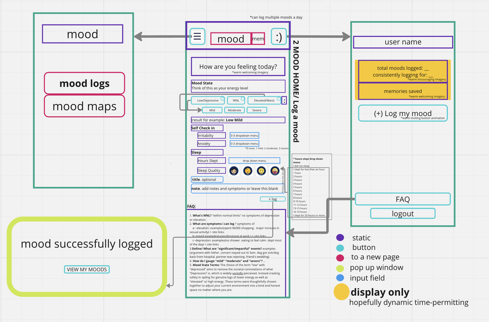
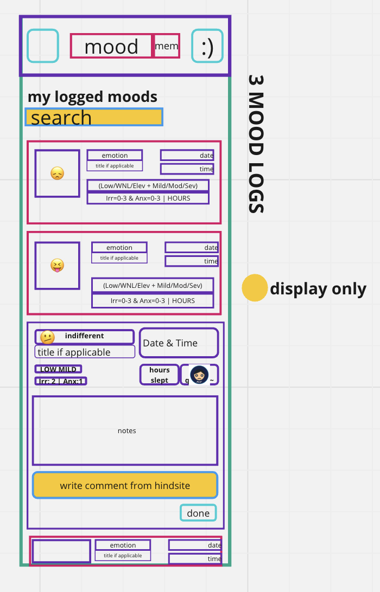
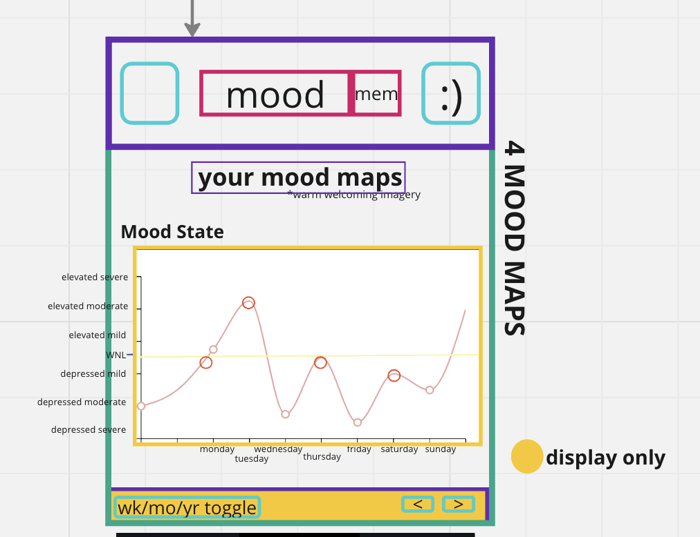

# Project Title
MoodMemory

## Overview

MoodMemory is a mood tracking (and eventually, memory logging) application that allows users to log & view mood patterns with ease. 
MoodMemory provides users a platform to manage their memory and mood with clarity in a painless way.

It is for mobile use in this submission, but *nice to have*: it will be available with responsive design to tablet and desktop sizes

### Problem

Mood tracking is a challenging chore to maintain 
- It is most popularly used by people with mood disorders, such as Bipolar Disorder, to take note of durations of manic states and depressive states. Mood tracking is also used to see patterns of what kind of external circumstances urge either state to halt or spring up, for each indivdual, from what may seem to be coming out of nowhere if tracking was not involved.
- Mood tracking keeps us informed about ourselves especially if our mood has been affecting our daily life and means to function, especially when it negatively impacts our ability to take care of our basic needs. 
- Mood tracking is also highly beneficial for those who menstruate whose symptoms are debilitating their physical and mental mobility.

### User Profile

- People with Seasonal Affective Disorder (SAD) / People affected by cold or gray weather and shorter days
    - to assure it is purely seasonal and not related to longer term depression
- People with Mood Disorders
    - needing to find their mood state patterns.
    - needing to find their external instigators.
    - wanting to see when they feel most stable in order to sustain those environments longterm.
- People about to take or are taking new medication 
    - to see if there are any side effects from their new medication affecting mood and energy.
- People who menstruate and have mood related symptoms
- People with PTSD
    - looking to track their triggers.
    - tracking the effectiveness of their therapy
- People in therapy 
    - looking to trac their progress.
- People with memory problems / declining mind flexibility
    - needing to remember important life events.
    - looking to stay reminded of their individuality.

### Features

- I want to log my mood without having to think about what to write. (AddMood Prompts)
- I want to log my mood with consisent necessary information. (Required Add Inputs)
- I want the ability look at my moods and easily assess patterns. (Mood Maps)
- I want an easy, succinct way to explain how I feel. ('"Emoji-Emotion Display" Choices' Array)
- I want a place where I can peruse through all of my past moods. (Mood Logs Tab)
- I want the ability to look back through years of my logs and see patterns (Toggle Mood Map)

## Implementation

### Tech Stack

- React
- MySQL
- Express
- Client libraries: 
    - react
    - react-router
    - axios
    - sass
    - chart.js
    - @mui/x-charts/LineChart

- Server libraries:
    - knex
    - express
    - firebase for user auth
    - nodemon
    - uuid
    - cors

### APIs

<!-- List any external sources of data that will be used in your app. -->

### Sitemap

- Welcome Page
- Mood Home Page / New Log - mood
- Mood Logs
- Mood Maps *the map itself may not be made dynamic by time of submission. i've never done a chart via code before*

### Mockups
**note** the blocks with ***yellow*** background colors are not meant to be functional or fully so for this project submission completion. These components are there for display of what's to come soon after bootcamp.
*this reminder will be noted by a legend within the mockups as well*

#### Welcome Page


#### Mood Home Page / Log a Mood


#### Mood Logs Page


#### Mood Maps Page


### Endpoints

**GET/moods**

- Get logged moods in db for mood library preview

Parameters:
- id: logged mood id as number
- date: mo/day/yr
- moodstate: energy state and state level combined

Response:
```
{
    "id": 1,
    "date": "01/01/2024",
    "moodstate": "Elevated Mild",
}
```

**GET /moods/:id/ <etc>**

- Get a logged mood by id for mood library viewing when extended.

Parameters:
- id: logged mood id as number
- timestamp: date will be shown with time hour and minute in us;en
- state: mood state 
- level ("Mild", "Moderate", "Severe")
- irr: numerical value 0 - 3 in 1 increments.
- anx: numerical value 0 - 3 in 1 increments.
- hours: numerical value 0 - 24 in 1 increments indicating hours slept.

Response:
```
{
    "id": 1,
    "timestamp": "1234567890",
    "emoji": ""
    "emotion": "motivated"
    "state": "Elevated",
    "level": "Moderate",
    "irritability": 1,
    "anxiety": 1,
    "hours": 4,
    "quality": "okay"
    "title": "new year",
    "notes": "-"
}
```
<!-- updated later -->

### Auth

- Firebase auth. Google Sign In.
    - User must log in to a valid google account in order to utilize the app and save logs.
    - Add states for logged in showing different UI where the user's name is displayed.

## Roadmap

<!-- Scope your project as a sprint. Break down the tasks that will need to be completed and map out timeframes for implementation. Think about what you can reasonably complete before the due date. The more detail you provide, the easier it will be to build. -->

- Create client
    - react project with routes, boilerplate pages, and CSS animations

- Create server
    - express project with routing
    - may be extracted out of the plan and use firebase instead if i am not able to make it work within the timeframe

- Feature: Login
    - Firebase

- Feature: Home page
    - Form submits to database

- Feature: View Logged moods
    - Implement view logs previews & view logs expanded which shows the entire complete form
    - Create GET /moods
    - Create GET /mood endpoint

- Redirect Pages
    - Successful Upload
    - Page not found
    - Loading animation

- Components for displays 
    - mood map (a nice to have if made to be dynamic)
    - Search bar
    - Comment from hindsite

- *nicetohave* Feature: Add hindsight comment to log
    - Form must submit data to my server & post the new comment. 
    - Create POST /comment endpoint   
    - Create DELETE /comment endpoint

- *nicetohave* Feature: Create account
    - Implement new user page if new Gmail signs in. 
    - Create POST /register endpoint

- Bug fixes

- (maybe) Deploy client (and server) projects

- DEMO DAY

## Nice-to-haves

POSSIBLY
- tablet & desktop responsive design
- contact page
- dynamic memory counter & dynamic mood counter in the user toggle side nav bar.
- unsaved log warning window
- search bar displays all moods in mood library with the typed keyword
- log in, create new user, forgot password.

PROBABLY NOT SOON
- Dynamic Mood Map & Sleep Map
- display the chosen emoji-emotion from the form just submitted into the "log successful" pop up.

DEFINITELY NOT DURING THE BOOTCAMP
- memory rooms page: space to organize memories into user specified compartments. + ability to view them via a "room carousel"
- memory features.
- place to store & manage mood patterns.
- combine the moodmap with the memory timeline in a joint line graph with adjustable date scopes. This feature is great for people with PTSD, or even PTSD from multiple events, especially when some expereinces may have been mentally blocked from a survival coping mechanism while the resulting fight/flight/fawn/freeze behaviors are still actively affecting the person.
- mood chart in table form in the all moods page
- visual graph of memory timeline
